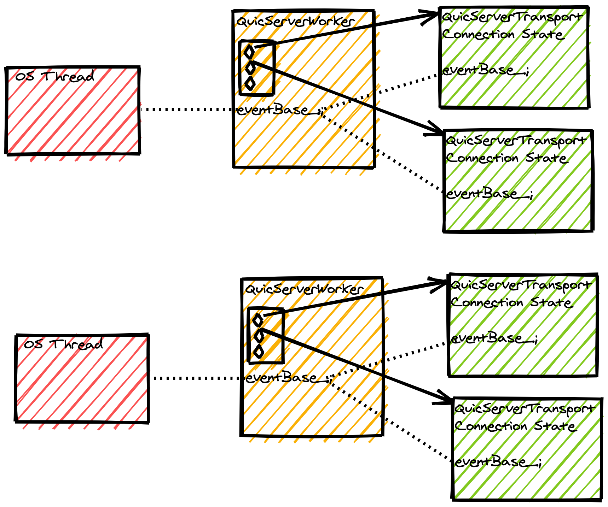

# Threading Model

## Folly and the EventBase

Like most C++ libraries and services at Meta, mvfst makes extensive use
of folly, our collection of high quality C++ code and abstractions. Of
particular interest is the
[EventBase](https://github.com/facebook/folly/blob/master/folly/io/async/README.md)
and other related classes. This is an abstraction on top of an asynchronous
[event loop](https://en.wikipedia.org/wiki/Event_loop) which drives mvfst's
state machine. The EventBase, much like mvfst itself, heavily utilizes
callback-based continuation and provides an easy way to integrate with
non-blocking I/O events presented by the OS on [file
descriptors](https://en.wikipedia.org/wiki/File_descriptor) like network
sockets. Said another way, most operating systems provide their own APIs for
I/O events, and the `EventBase` is an abstraction that lets us integrate with
these APIs using a stable C++ API.

## Server Threading Example

In a server such as Proxygen, our reverse proxy at Meta, we have (roughly)
CPU-many "worker threads" servicing connections. To support this in mvfst we
have a `QuicServerWorker` abstraction, which itself has a 1:1 correspondence
with an underlying OS thread. This also corresponds to exactly one `EventBase`
object per worker. Each `QuicServerWorker` stores a table of active
connections, each of which is a `QuicServerTransport`. The `QuicServerTransport`
objects share the same `EventBase` object with the worker, and use it to queue
up callbacks to drive their own connection state forward.

An important thing to note from this diagram is that a single mvfst
connection is only ever modified by a single thread. This allows mvfst to
completely eschew any sort of locking to prevent concurrent access to its
data. Only one thread ever has access to any given connection, and a thread
can only ever be modifying a single connection at a time.

We can also see that, as covered in the blocking vs. non-blocking I/O page,
a single thread in a mvfst-based server can service many connections at once.
